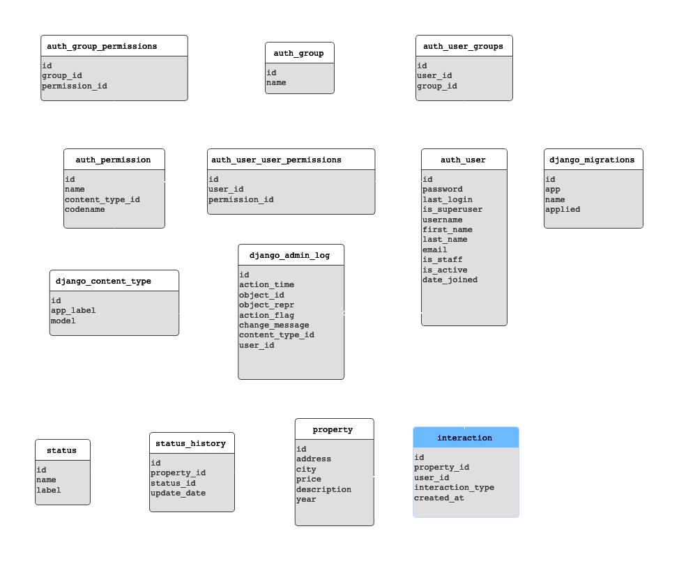

# Real state properties microservices

## Introducción

Este proyecto consiste en el desarrollo de dos microservicios que permitirán a los usuarios consultar los inmuebles disponibles para la venta y, adicionalmente, darles "me gusta" a los inmuebles que les resulten interesantes. Los usuarios podrán aplicar diferentes filtros a sus búsquedas para facilitar la localización de inmuebles específicos y se mantendrá un registro del histórico de "me gusta" por usuario.

## Tecnologías Utilizadas

- **Lenguaje**: Python
- **Framework**: FastAPI para la creación de los microservicios.
- **Base de Datos**: MySQL
- **ORM**: No aplica para el caso, se definen directamente las querys de SQL.
- **Autenticación**: No implementada
- **Documentación de API**: Swagger
- **Pruebas Unitarias**: Pytest para las pruebas unitarias.
- **Versionamiento**: Git / GitHub

## Estructura del Proyecto

```
real-state-microservices  
    ├── api                     # API routes and request/response models are defined.
    │   ├── endpoints           # Contains the API route definitions.
    │   └── schemas             # Contains data validation and serialization schemas.
    ├── controllers             # Holds the business logic for handling requests.
    ├── infrastructure          # Contains modules related to the lower-level infrastructure of the project, such as database connections, external services, or any other resources the application interacts with.
    │   └── sql                 # Contains SQL queries, migrations, or raw SQL files used for database interactions.
    │       └── repositories    # Contains the repository layer, which abstracts the database operations.
    ├── main.py                 # The entry point of the application.
    ├── requirements.txt        # A text file listing all the Python dependencies required for the project.
    ├── settings.py             # Configuration file for the project.
    ├── tests.py                # Test cases
    └── README.md               # The main documentation file for the project.
```
## Historias de Usuario

### Servicio de Consulta

1. Los usuarios pueden consultar los inmuebles con los estados: `pre_venta`, `en_venta` y `vendido`. Inmuebles con estados distintos nunca deben ser visibles por el usuario.
2. Los usuarios pueden filtrar los inmuebles por:
   - Año de construcción
   - Ciudad
   - Estado
3. Los usuarios pueden aplicar varios filtros en la misma consulta.
4. Los usuarios pueden ver la siguiente información del inmueble:
   - Dirección
   - Ciudad
   - Estado
   - Precio de venta
   - Descripción

## Servivcio consulta de propiedades

### Inicializar servicio 

```bash
cd consulting_ms

# Recuerda crear tu ambiente venv o conda
pip install -r requirements.txt

python main.py
```

### Ejecutar pruebas

```bash
pip install pytest

pytest tests.py
```

## Servicio de “Me gusta”

1. Los usuarios pueden darle "me gusta" a un inmueble en específico y esto debe quedar registrado en la base de datos.
2. Los "me gusta" son de usuarios registrados, y debe quedar registrado en la base de datos el histórico de “me gusta” de cada usuario y a cuáles inmuebles.

### Diagrama de Entidad-Relación (Segundo Requerimiento)

Para extender el diagrama de Entidad-Relación original, se propone agregar la tabla `interaction`, esta almacenará las reacciones de los usuarios (me gusta) a las propiedades inmobiliarias permitiendo hacer seguimiento de sus preferencias.



### Estructura de la tabla: `interaction`

- `id` (INT, Primary Key, Auto-incremental): Un identificador único para cada registro de interacción.
- `property_id` (INT, Foreign Key): Hace referencia a la propiedad que ha sido marcada con "me gusta".
- `user_id` (INT, Foreign Key): Hace referencia al usuario que marcó "me gusta" en la propiedad.
- `interaction_type` (VARCHAR): Para almacenar el tipo de interacción (por ejemplo, 'me gusta', 'no me gusta', etc.). Esto es útil si se planea añadir más tipos de interacciones en el futuro.
- `created_at` (TIMESTAMP): La fecha y hora en que se realizó la interacción.

### Código SQL para Extender el Modelo

```SQL
CREATE TABLE interaction (
    id INT AUTO_INCREMENT PRIMARY KEY,
    property_id INT NOT NULL,
    user_id INT NOT NULL,
    interaction_type VARCHAR(50),
    created_at TIMESTAMP DEFAULT CURRENT_TIMESTAMP,
    FOREIGN KEY (property_id) REFERENCES property(property_id),
    FOREIGN KEY (user_id) REFERENCES auth_user(user_id),
    UNIQUE (property_id, user_id)  -- To ensure a user can like a property only once
);

```


## Preguntas y Resoluciones

1. **Duda**: ¿Qué pasa si hay un resultado de las propiedades con registros incompletos?

Se devolverá una respuesta parcial con status code `207`, además se indicará qué información de los registros tiene datos incompletos.

2. **Duda**: ¿Debo crear una nueva tabla para almacenar los "me gusta" o puedo agregar una nueva columna a la tabla propiedades para almacenar el número total de "me gusta"?

Se decidió plantear la creación de la tabla `interaction` ya que nos permite identificar qué usuarios estan relacionados a las interacciones. Además es necesario verificar que el usuario este registrado.
